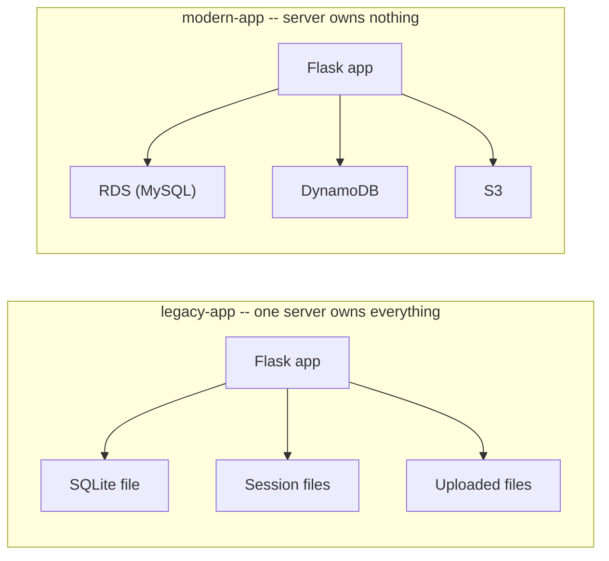
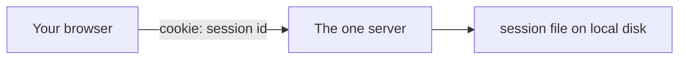
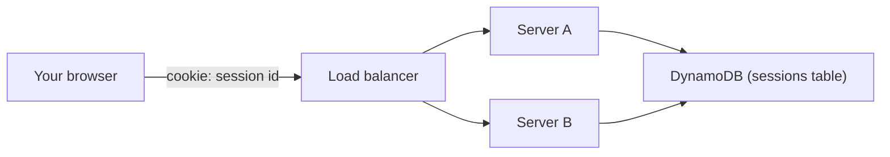
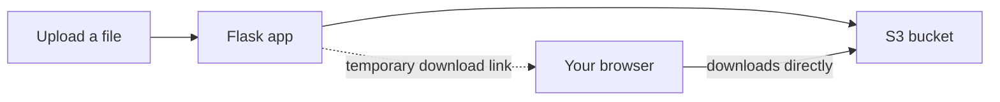

# How the app was rebuilt

`docs/legacy-assessment.md` covers *why* the legacy app has to move.
This is *how* — the four things that changed inside the code itself to
turn a single-server app into one that doesn't care which server
answers a request. This is milestone 3; the AWS architecture these
services actually run in (VPC, load balancer, auto-scaling) is a
separate diagram, coming in milestone 8.

Same business logic both sides — same models, same pages, same forms.
Only where things are *stored* changes.

## The shape of the problem

Every one of the four changes below follows the same pattern: something
that used to live on the server's own hard drive moves to a shared
service that every server can reach equally.

Once nothing lives on the server itself, any number of servers can run
the exact same app, and losing one doesn't lose any data.

## 1. Sessions: a file on disk → DynamoDB

A "session" is just how the app remembers you're logged in between
page loads — normally a small id in a cookie, pointing at your login
info stored somewhere on the server.

**The problem:** `legacy-app` stores that "somewhere" as a file next to
the running process. That file only exists on the one server that
created it.

Put a second server behind a load balancer and this breaks immediately:
log in, get routed to server A, refresh the page, get routed to server
B — server B has never heard of you, so you're logged out.

**The fix:** the session data moves to DynamoDB, a database every
server can read from. The cookie still just holds an id — it's what
that id points to that changed.

Now it doesn't matter which server answers — both read the same
session table. There's no ready-made plugin for this pairing (Flask's
usual session add-on doesn't support DynamoDB), so `session_dynamodb.py`
implements it directly: same idea as any other session backend, just
pointed at DynamoDB instead of a file or a Redis cache.

## 2. Uploads: local disk → S3

**The problem:** an uploaded receipt or invoice attachment gets saved
straight to a folder on disk. Same issue as sessions — it only exists
on the server that received the upload. Server B can't serve a file it
never received.

**The fix:** uploads go to S3 instead. Downloading a file doesn't
stream it through the app at all — the app hands the browser a
temporary, expiring link straight to S3, and S3 serves the file
directly.

## 3. Database: SQLite → RDS (MySQL)

**The problem:** SQLite is a single file. It works fine for one
process, but it isn't built for multiple servers writing to it at
once, and there's no automatic backup — if that file is gone, so is
every invoice ever created.

**The fix:** a managed MySQL database (RDS) that every server connects
to over the network instead of opening a local file. The code barely
changes — it's the same SQLAlchemy models and queries either way, just
pointed at a different address. RDS also handles automated backups,
which a SQLite file on a single disk never had.

## 4. Secrets: hardcoded → environment variables (+ SSM)

**The problem:** database passwords and API keys shouldn't live in the
code itself — anyone who can read the source can read the password.

**The fix:** `config.py` reads everything from environment variables
at startup. In production, the database password specifically is
pulled from AWS's Parameter Store (SSM) at runtime rather than set as
a plain environment variable — so it's never sitting in a config file,
a shell history, or a deploy script.

## Why this order matters

Sessions and uploads had to move *before* the load balancer and
auto-scaling group exist — there's no point putting two servers behind
a load balancer if only one of them can actually answer a logged-in
user correctly. This refactor is what makes milestone 6 (proving the
app survives an instance disappearing) possible at all.
