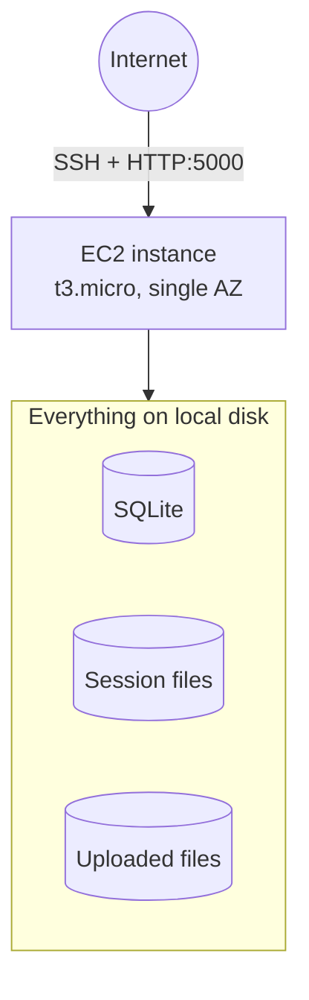

# Architecture: before and after

Companion to `docs/legacy-assessment.md` (why it has to move) and
`docs/app-rebuild.md` (what changed in the code). This is the
infrastructure picture: where things physically run.

## Before: single EC2 instance

- One `t3.micro`, one AZ, no redundancy anywhere
- Default VPC, public subnet, public IP
- Everything lives on that one box's local disk:
  - SQLite database
  - Session files
  - Uploaded attachments
- No load balancer, DNS/IP points straight at the instance
- Access: SSH (the one place in this whole project SSH is used,
  deliberate, matches how a typical SMB actually runs a box)

- **Single point of failure**: that one box going down takes
  everything with it
- **No horizontal scaling**: adding a second box wouldn't help, see
  `docs/legacy-assessment.md` for why

## After: three-tier, two AZs

- Public tier: ALB only, spans both AZs
- App tier: Auto Scaling Group (min 1, max 2), no public IP, no SSH,
  SSM Session Manager only
- Data tier: RDS (Single-AZ, cost decision), DynamoDB, S3, none of it
  tied to any specific app instance
- Security groups scoped tier-to-tier only (ALB to app to data,
  nothing broader)

- **No single point of failure** in the app tier: either instance can
  disappear and the other keeps serving (proven live in Milestone 6:
  84 requests, 0 failures, during an actual instance termination)
- **Horizontal scaling actually works**: a third instance would need
  zero code changes, because nothing lives on any instance's own disk
- **Cost trade-offs made on purpose**:
  - RDS Single-AZ, not Multi-AZ: cheaper, accepted downtime risk
    for a portfolio demo
  - No NAT Gateway left running: created once for the demo, deleted
    during teardown (see Part 13 of either simulation guide)
  - No HTTPS listener: no domain/ACM certificate set up for this
    demo, HTTP only

## What moved, one line each

| Piece | Before | After |
|---|---|---|
| Compute | 1 instance, 1 AZ | 1-2 instances, 2 AZs, auto-scaled |
| Sessions | Local files | DynamoDB |
| Uploads | Local disk | S3 |
| Database | SQLite file | RDS MySQL |
| Admin access | SSH | SSM Session Manager |
| Entry point | Direct to instance | Load balancer |
