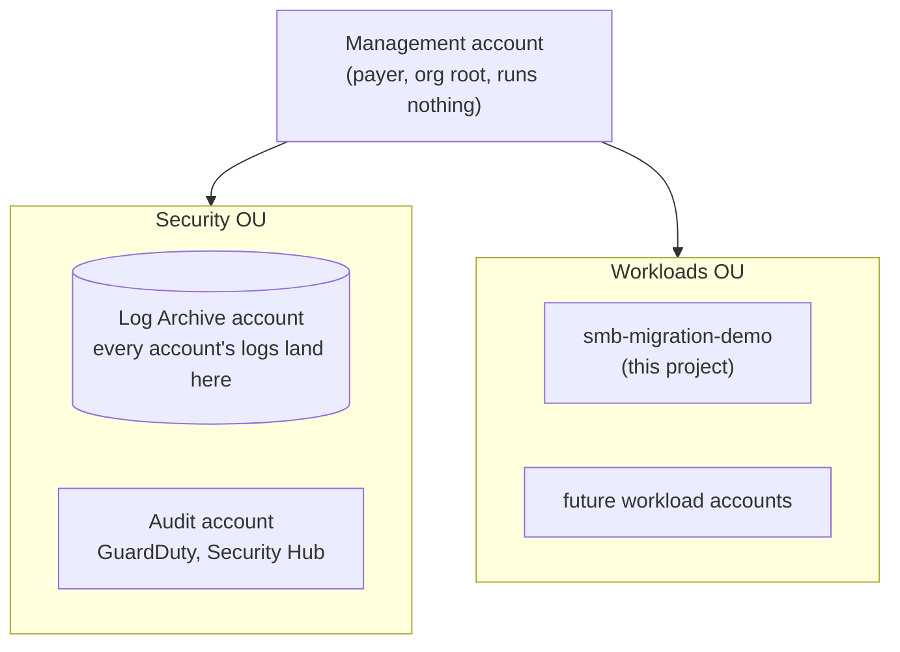

# Multi-account landing zone

A design for the governance layer that would sit above this project once
the client has more than one workload on AWS. This is a **documented
design, not provisioned infrastructure**: the steps below are written to be
actually followed later, but nothing here has been built yet. See
`docs/roadmap.md` for how this fits the rest of the story.

## Why this exists

Everything else in this repo lives in one AWS account, which is fine for
one workload. The client has said more workloads are coming, each one
needing its own account for proper isolation (a mistake or a compromise in
one workload shouldn't be able to touch another). Without a plan for that
up front, every new workload account starts from zero: its own IAM setup,
its own logging, its own security tooling, all built and maintained
separately. A landing zone is the standard AWS answer to that: a small set
of shared accounts that every workload account plugs into automatically,
the AWS equivalent of a golden VM template that already has its GPOs,
monitoring agent, and domain join baked in before anyone touches it.

## The account structure

Four accounts, which happens to be exactly what AWS Control Tower creates
by default, a well-trodden baseline rather than something bespoke:

| Account | Role | On-prem equivalent |
|---|---|---|
| **Management** | The payer. Owns the AWS Organization, enforces guardrails on everything below it. Runs no workloads itself. | Root of the AD forest |
| **Log Archive** | Every account's activity logs land here automatically, in storage the workload accounts can't touch or delete. | Central syslog/SIEM box |
| **Audit** | Security tooling lives here with read-only visibility into every other account. | A SOC segment with read access into every VLAN |
| **smb-migration-demo** (Workloads OU) | This project, unchanged, just relocated under the landing zone instead of sitting directly in the payer account. | One VM cluster, walled off from the others |

Two Organizational Units (OUs) group them: **Security** (Log Archive +
Audit) and **Workloads** (this project, with room for more accounts
later as the client adds workloads).



Each box under `Workloads` is a fully isolated AWS account. The
`Security` OU's two accounts are the only ones with visibility across
everything else; a workload account can't see or reach another
workload account at all, by design.

## Roles provisioned, account by account

Every account ends up with two kinds of access: a narrow set of
service/automation roles it needs to function, and human access via IAM
Identity Center (Phase 7). Human access is federated centrally from
Phase 7 onward, not a separate IAM user per account per person, so it's
called out per account below rather than repeated four times.

### Management

The payer, the organization root, and the only account with authority
over everything below it. Runs no workloads, no application IAM roles.

- Every member account created in Phase 2 gets an auto-created
  `OrganizationAccountAccessRole` trusting the Management account, so
  someone signed in here can always assume their way into any member
  account. This is the landing zone's break-glass path, and part of why
  Management's own access should be tightly held.
- IAM Identity Center itself, and the permission sets assigned into
  every other account, are configured here (Phase 7).

### Log Archive

Exists purely to hold logs the workload accounts can't touch, not to be
signed into day to day.

- No routine human role. Access here should be rare, deliberate, and
  itself logged.
- The actual access-control mechanism is a resource policy on the
  CloudTrail S3 bucket (set up automatically by the organization-trail
  wizard in Phase 4), not an IAM role: every account in the org can
  write to it, none can read or delete from it, not even this account's
  own root user for the delete case. The IAM equivalent of write-once
  media.
- Optional: a read-only `LogArchiveAuditor` permission set via Identity
  Center, only if the security team needs to query raw logs directly
  instead of through the Audit account's tooling.

### Audit

Read-only visibility into every other account's security posture, so
the people investigating an incident never need standing access inside
the account where it happened.

- GuardDuty delegated-administrator role and, optionally, Security Hub
  delegated-administrator role (Phase 5) — both AWS service-linked,
  granted by the Management account, letting Audit see findings across
  the whole organization without being invited into each account one at
  a time.
- If Phase 4's optional Config aggregator is set up, the same
  cross-account read pattern applies there too.
- A `SecurityAuditor` permission set via Identity Center: read-only
  across every account in the org, for whoever is actually doing the
  security review work day to day.

### Workloads (`smb-migration-demo`, and future workload accounts)

Where the application actually runs. Everything built in the rest of
this repo lives here, unchanged by any of this.

- `smb-migration-demo-cli`: the existing scoped IAM user from
  `infrastructure/iam/README.md`. Unchanged — long-lived credentials for
  CLI automation (`cdk deploy` and similar), not a human login, which is
  exactly why Phase 7 keeps it alongside Identity Center instead of
  replacing it.
- `smb-migration-demo-app-role`: the existing EC2 instance role from
  Part 6 of the simulation guide. Unchanged — what the application
  instances themselves assume at runtime to read secrets and reach
  RDS/DynamoDB/S3.
- A `WorkloadAdmin` permission set via Identity Center (Phase 7), for
  engineers who need day-to-day Console/CLI access to this account. This
  is what a landing zone replaces "a separate IAM user per person per
  account" with, and it's the only genuinely new human-facing access
  this phase adds to this account.
- All of the above are still bound by the `Workloads` OU's SCP
  (Phase 6): an SCP applies above IAM, so it constrains
  `WorkloadAdmin`, the app role, and the CLI user alike, regardless of
  how permissive any one of them is on its own.

## Phase 1: Enable AWS Organizations

Done from whatever AWS account will become the Management account (the
one that already pays the bill).

**Console: AWS Organizations → Create an organization**
- Choose **Enable all features**, not just consolidated billing. SCPs
  (the guardrails in Phase 6) require this, and it can't be turned on
  partially later.

**Before creating the other accounts**, line up unique email addresses,
one per new account. AWS requires each account to have an email address
no other AWS account already uses. If you don't have separate mailboxes
for this, most providers (Gmail included) support `+` aliasing on one
inbox: `you+awsmgmt@example.com`, `you+logarchive@example.com`, and
`you+audit@example.com` all deliver to the same mailbox while satisfying
AWS's uniqueness requirement.

## Phase 2: Create the member accounts

**Console: AWS Organizations → AWS accounts → Add an AWS account**, twice:
- Name: `smb-migration-demo-log-archive`, email: the log-archive address
  from Phase 1
- Name: `smb-migration-demo-audit`, email: the audit address from Phase 1

Each takes a few minutes to provision. New accounts created this way
don't have a root password set yet, use the **forgot password** flow on
the sign-in page with each account's email to set one, the same as any
new AWS account's first-time setup.

(The existing `smb-migration-demo` workload account from the rest of
this repo doesn't need to be recreated, it just needs inviting into the
organization in Phase 3, and optionally relocating its resources in
Phase 8 if it's not already a separate account from the Management one.)

## Phase 3: Organize into OUs

**Console: AWS Organizations → AWS accounts → Organize accounts**
- Create OU: `Security`
- Create OU: `Workloads`
- Move `smb-migration-demo-log-archive` and `smb-migration-demo-audit`
  into `Security`
- Move `smb-migration-demo` into `Workloads`

## Phase 4: Centralized logging

**Console, from the Management account: CloudTrail → Trails → Create
trail**
- Enable **"Apply trail to my organization"**
- Storage location: create a new S3 bucket, this is where it should
  live, in the Log Archive account (CloudTrail's organization-trail
  wizard sets up the cross-account bucket policy automatically so every
  member account can write to it but not read or delete from it)

This alone means every account's API activity, going forward, is
captured somewhere the workload accounts themselves have no permission to
tamper with, the point of a dedicated log-archive account.

Optional, worth doing if the client cares about compliance history, not
just security events: **Console, from the Audit account: AWS Config →
Aggregators → Create aggregator**, source: the whole organization. This
gives one place to see every account's resource configuration over time,
not just their API calls.

## Phase 5: Centralized security tooling

**Console, from the Management account: GuardDuty → Settings → Delegated
administrator**
- Delegate to the Audit account

**Console, from the Audit account: GuardDuty → Settings**
- Enable, and turn on **auto-enable for new organization accounts** so
  every future workload account gets threat detection without a manual
  step

Repeat the same delegated-administrator pattern for **Security Hub** if
the client wants a consolidated security findings dashboard across every
account, not just GuardDuty's threat findings.

## Phase 6: Guardrails (Service Control Policies)

SCPs are org-wide guardrails, enforced above IAM, an account's own admin
cannot override or disable them. This is genuinely different from IAM
policies (which grant permissions within an account); SCPs only ever
restrict, and they apply even to that account's root user.

**Console, from the Management account: Organizations → Policies →
Service control policies → Create policy**

A reasonable starting pair for this project's Workloads OU, matching
decisions already locked in for the app itself (region, IMDSv2):
[`infrastructure/landing-zone/smb-migration-demo-scp-workloads.json`](../infrastructure/landing-zone/smb-migration-demo-scp-workloads.json),
paste its contents in directly. It locks the OU to `ap-southeast-1` and
blocks leaving the organization.

Attach it to the `Workloads` OU (not the whole organization, the
Security OU's own accounts legitimately need broader access for their
job). Test any new SCP against a non-critical account first: a
misconfigured SCP can lock an account out of actions it actually needs,
including sometimes IAM itself.

## Phase 7: Centralized identity

**Console, from the Management account: IAM Identity Center → Enable**

Create a permission set (e.g. `WorkloadAdmin`) and assign it to the
`smb-migration-demo` account. This gives one federated login across every
account in the organization instead of a separate IAM user per account.

Worth being explicit about a trade-off here: the existing
`smb-migration-demo-cli` IAM user (see `infrastructure/iam/README.md`)
doesn't need to be replaced for this project's own CDK deployments.
Identity Center is built for human, browser-based sign-in; long-lived
CLI credentials for automation (like `cdk deploy`) still work more simply
as a scoped IAM user or role. Centralized identity and
automation-friendly credentials solve different problems, this project
would keep both.

## Phase 8: Move the existing workload under the landing zone

Only needed if `smb-migration-demo` isn't already a separate AWS account
from whatever became the Management account in Phase 1. Since everything
in `infrastructure/cdk/` is already infrastructure as code, this is a
redeploy, not a rebuild:

```bash
cd infrastructure/cdk
# with AWS credentials for the *new* smb-migration-demo member account
cdk bootstrap aws://<new-account-id>/ap-southeast-1
cdk deploy --all --require-approval never
```

Then tear down whatever copy of the stack still exists in the old
location (`cdk destroy --all --force` there, RDS auto-snapshots first as
usual), and update `infrastructure/iam/README.md`'s setup steps to
reflect the new account if this actually gets carried out.

## Cost and reversibility

- **AWS Organizations itself is free.** What isn't: AWS Config
  (priced per configuration item recorded, small but ongoing once
  enabled org-wide) and GuardDuty (priced per event analyzed). At this
  project's scale, expect low single-digit dollars a month, not
  something that needs urgent teardown between sessions the way NAT
  Gateway or RDS does.
- **This is not as easy to undo as a VPC.** Closing an AWS member
  account triggers a mandatory 90-day waiting period before it's
  actually gone, and leaving an organization has its own restrictions.
  Treat standing this up as a real, semi-permanent decision, not
  something to spin up for a demo and tear down after, the way the rest
  of this project's AWS resources are meant to be handled.
