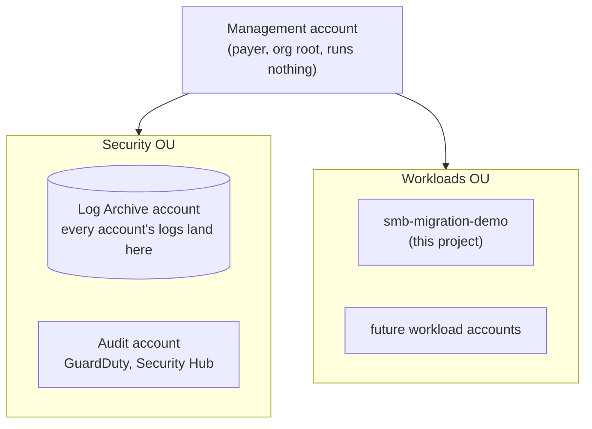

# Multi-account landing zone

A design for the governance layer that would sit above this project once
the client has more than one workload on AWS. This is a **documented
design, not provisioned infrastructure**: the steps below are written to be
actually followed later, but nothing here has been built yet. See
`docs/roadmap.md` for how this fits the rest of the story.

## Why this exists

Everything else in this repo lives in one AWS account, which is fine for
one workload. The client has said more workloads are coming, each one
needing its own account for proper isolation (a mistake or a compromise in
one workload shouldn't be able to touch another). Without a plan for that
up front, every new workload account starts from zero: its own IAM setup,
its own logging, its own security tooling, all built and maintained
separately. A landing zone is the standard AWS answer to that: a small set
of shared accounts that every workload account plugs into automatically,
the AWS equivalent of a golden VM template that already has its GPOs,
monitoring agent, and domain join baked in before anyone touches it.

## The account structure

Four accounts, which happens to be exactly what AWS Control Tower creates
by default, a well-trodden baseline rather than something bespoke:

| Account | Role | On-prem equivalent |
|---|---|---|
| **Management** | The payer. Owns the AWS Organization, enforces guardrails on everything below it. Runs no workloads itself. | Root of the AD forest |
| **Log Archive** | Every account's activity logs land here automatically, in storage the workload accounts can't touch or delete. | Central syslog/SIEM box |
| **Audit** | Security tooling lives here with read-only visibility into every other account. | A SOC segment with read access into every VLAN |
| **smb-migration-demo** (Workloads OU) | This project, unchanged, just relocated under the landing zone instead of sitting directly in the payer account. | One VM cluster, walled off from the others |

Two Organizational Units (OUs) group them: **Security** (Log Archive +
Audit) and **Workloads** (this project, with room for more accounts
later as the client adds workloads).



Each box under `Workloads` is a fully isolated AWS account. The
`Security` OU's two accounts are the only ones with visibility across
everything else; a workload account can't see or reach another
workload account at all, by design.

## Phase 1: Enable AWS Organizations

Done from whatever AWS account will become the Management account (the
one that already pays the bill).

**Console: AWS Organizations → Create an organization**
- Choose **Enable all features**, not just consolidated billing. SCPs
  (the guardrails in Phase 6) require this, and it can't be turned on
  partially later.

**Before creating the other accounts**, line up unique email addresses,
one per new account. AWS requires each account to have an email address
no other AWS account already uses. If you don't have separate mailboxes
for this, most providers (Gmail included) support `+` aliasing on one
inbox: `you+awsmgmt@example.com`, `you+logarchive@example.com`, and
`you+audit@example.com` all deliver to the same mailbox while satisfying
AWS's uniqueness requirement.

## Phase 2: Create the member accounts

**Console: AWS Organizations → AWS accounts → Add an AWS account**, twice:
- Name: `smb-migration-demo-log-archive`, email: the log-archive address
  from Phase 1
- Name: `smb-migration-demo-audit`, email: the audit address from Phase 1

Each takes a few minutes to provision. New accounts created this way
don't have a root password set yet, use the **forgot password** flow on
the sign-in page with each account's email to set one, the same as any
new AWS account's first-time setup.

(The existing `smb-migration-demo` workload account from the rest of
this repo doesn't need to be recreated, it just needs inviting into the
organization in Phase 3, and optionally relocating its resources in
Phase 8 if it's not already a separate account from the Management one.)

## Phase 3: Organize into OUs

**Console: AWS Organizations → AWS accounts → Organize accounts**
- Create OU: `Security`
- Create OU: `Workloads`
- Move `smb-migration-demo-log-archive` and `smb-migration-demo-audit`
  into `Security`
- Move `smb-migration-demo` into `Workloads`

## Phase 4: Centralized logging

**Console, from the Management account: CloudTrail → Trails → Create
trail**
- Enable **"Apply trail to my organization"**
- Storage location: create a new S3 bucket named
  `smb-migration-demo-log-archive`, this is where it should live, in
  the Log Archive account (CloudTrail's organization-trail wizard sets
  up the cross-account bucket policy automatically so every member
  account can write to it but not read or delete from it)

This alone means every account's API activity, going forward, is
captured somewhere the workload accounts themselves have no permission to
tamper with, the point of a dedicated log-archive account.

Optional, worth doing if the client cares about compliance history, not
just security events: **Console, from the Audit account: AWS Config →
Aggregators → Create aggregator**, source: the whole organization. This
gives one place to see every account's resource configuration over time,
not just their API calls.

## Phase 5: Centralized security tooling

**Console, from the Management account: GuardDuty → Settings → Delegated
administrator**
- Delegate to the Audit account

**Console, from the Audit account: GuardDuty → Settings**
- Enable, and turn on **auto-enable for new organization accounts** so
  every future workload account gets threat detection without a manual
  step

Repeat the same delegated-administrator pattern for **Security Hub** if
the client wants a consolidated security findings dashboard across every
account, not just GuardDuty's threat findings.

## Phase 6: Guardrails (Service Control Policies)

SCPs are org-wide guardrails, enforced above IAM, an account's own admin
cannot override or disable them. This is genuinely different from IAM
policies (which grant permissions within an account); SCPs only ever
restrict, and they apply even to that account's root user.

**Console, from the Management account: Organizations → Policies →
Service control policies → Create policy**

A reasonable starting pair for this project's Workloads OU, matching
decisions already locked in for the app itself (region, IMDSv2):
[`infrastructure/landing-zone/smb-migration-demo-scp-workloads.json`](../infrastructure/landing-zone/smb-migration-demo-scp-workloads.json),
paste its contents in directly. It locks the OU to `ap-southeast-1` and
blocks leaving the organization.

Attach it to the `Workloads` OU (not the whole organization, the
Security OU's own accounts legitimately need broader access for their
job). Test any new SCP against a non-critical account first: a
misconfigured SCP can lock an account out of actions it actually needs,
including sometimes IAM itself.

## Phase 7: Centralized identity and roles

**Console, from the Management account: IAM Identity Center → Enable**

The point of Identity Center is one federated login across every account,
with what a person can actually *do* once logged in controlled by which
permission set they're assigned to in which account, not by which IAM
user they happen to have credentials for. Think of a permission set as a
job role, not a person: the same `WorkloadAdmin` role gets handed to
whoever is currently building a given workload, the role doesn't change,
the person holding it does.

Three roles, matching the three kinds of account in this structure:

| Permission set | Assigned in | What it can do | Who holds it |
|---|---|---|---|
| **OrgAdmin** | Management account only | Organizations, OUs, SCPs, Identity Center itself, read-only billing. Nothing else, specifically no EC2/S3/RDS/etc, since the Management account should never run workloads. | Whoever owns the AWS relationship itself (business/account owner), rarely used day to day |
| **SecurityAuditor** | Audit account, with cross-account read access via the GuardDuty/Security Hub delegation from Phase 5 | Read-only: GuardDuty findings, Security Hub, CloudTrail events, Config history, and the Log Archive bucket. No write access anywhere. | Anyone who needs visibility into security posture without needing (or being trusted with) the ability to change anything |
| **WorkloadAdmin** | One specific workload account, e.g. `smb-migration-demo` | Full admin, but only inside that one account | Whoever is actually building/operating that workload |

`OrgAdmin` and `SecurityAuditor` are custom, scoped policies, kept
deliberately narrow the same way `infrastructure/iam/`'s own policies
are:
[`infrastructure/landing-zone/smb-migration-demo-permission-set-org-admin.json`](../infrastructure/landing-zone/smb-migration-demo-permission-set-org-admin.json)
and
[`infrastructure/landing-zone/smb-migration-demo-permission-set-security-auditor.json`](../infrastructure/landing-zone/smb-migration-demo-permission-set-security-auditor.json).
`WorkloadAdmin` is the one place this design uses AWS's own managed
`AdministratorAccess` policy rather than a custom one, and that's a
deliberate choice, not a shortcut: a workload builder genuinely needs
broad flexibility to create whatever that app needs, and because a
permission set is always assigned against one specific account,
"administrator" here only ever means administrator *of that one
isolated account*, never of the organization. This is the same pattern
AWS Control Tower uses for its own default workload permission set.

Create all three in **IAM Identity Center → Permission sets → Create
permission set**, then assign each to the right account(s) under
**AWS accounts → (account) → Assign users or groups**.

Worth being explicit about a trade-off here: the existing
`smb-migration-demo-cli` IAM user (see `infrastructure/iam/README.md`)
doesn't need to be replaced for this project's own CDK deployments.
Identity Center is built for human, browser-based sign-in; long-lived
CLI credentials for automation (like `cdk deploy`) still work more simply
as a scoped IAM user or role. Centralized identity and
automation-friendly credentials solve different problems, this project
would keep both.

## Phase 8: Move the existing workload under the landing zone

Only needed if `smb-migration-demo` isn't already a separate AWS account
from whatever became the Management account in Phase 1. Since everything
in `infrastructure/cdk/` is already infrastructure as code, this is a
redeploy, not a rebuild:

```bash
cd infrastructure/cdk
# with AWS credentials for the *new* smb-migration-demo member account
cdk bootstrap aws://<new-account-id>/ap-southeast-1
cdk deploy --all --require-approval never
```

Then tear down whatever copy of the stack still exists in the old
location (`cdk destroy --all --force` there, RDS auto-snapshots first as
usual), and update `infrastructure/iam/README.md`'s setup steps to
reflect the new account if this actually gets carried out.

## Doing Phases 2, 3, and 6 as code instead of by hand

The main migration went Console-first, then CDK, once the manual build
proved the architecture worked. The same thing exists here now:
[`infrastructure/landing-zone/cdk/`](../infrastructure/landing-zone/cdk/)
is a CDK app that creates the two OUs, the Log Archive and Audit
accounts, and attaches the Workloads SCP, the same resources as Phases
2, 3, and 6 above, as code instead of console clicks.

```bash
cd infrastructure/landing-zone/cdk
python -m venv .venv
# Windows: .venv\Scripts\pip install -r requirements.txt
# macOS/Linux: .venv/bin/pip install -r requirements.txt

cdk synth \
  --context organization_root_id=$(aws organizations list-roots --query 'Roots[0].Id' --output text) \
  --context log_archive_email=you+logarchive@example.com \
  --context audit_email=you+audit@example.com
```

`organization_root_id` only exists once Phase 1 (creating the
organization itself) has already happened by hand, this stack builds
on top of that, it doesn't create the organization. Swap `cdk synth`
for `cdk deploy --require-approval never` to actually create the
resources, once the decision to build this for real has been made.

This is a separate CDK app from `infrastructure/cdk/` on purpose, not
folded into its `cdk deploy --all`. That one deploys the workload
itself and runs inside whatever account already has it; this one has
to run from the Management account, targeting the organization's root,
before the workload account is even a landing-zone member yet.
Bundling the two would mean one `cdk deploy --all` accidentally
touching two completely different scopes.

Worth knowing going in: CDK has no higher-level constructs for AWS
Organizations yet, only the L1 resources that map straight to
CloudFormation (`CfnOrganizationalUnit`, `CfnAccount`, `CfnPolicy`).
That's a real gap in CDK itself, not a shortcut taken here, Organizations
support in CloudFormation is newer than most other services and the
higher-level abstractions haven't caught up.

## Verify the guardrails actually work

Once this is actually built, the same instinct behind this project's
statelessness/HA proof applies here too: don't just trust that a
policy does what its JSON says, go confirm it.

**The region lock actually blocks something**, from a role assigned in
the `Workloads` OU:

```bash
aws ec2 describe-instances --region us-east-1
```

Expect an `AccessDenied` error whose message specifically mentions an
explicit deny from a service control policy, not a generic permissions
error, that distinction is how you tell the SCP caused it rather than
the permission set simply not granting EC2 access.

**The organization can't be left from a workload account:**

```bash
aws organizations leave-organization
```

Should fail the same way, denied by the SCP, not by a missing
permission.

**`SecurityAuditor` can see findings but can't change anything**, from
the Audit account:

```bash
aws guardduty list-findings --detector-id <detector-id>   # should work
aws ec2 terminate-instances --instance-ids <any-instance-id>  # should fail, no permission granted at all
```

**`OrgAdmin` can manage the organization but can't touch workload-shaped
services**, from the Management account:

```bash
aws organizations list-accounts   # should work
aws ec2 describe-instances        # should fail, confirms the Management account really can't run workloads under this role
```

If any of these come back the wrong way (an action that should be
denied succeeds, or one that should work gets blocked), that's a real
policy bug to fix before trusting this in front of the client, the same
reasoning as testing any new SCP against a non-critical account first.

## Cost and reversibility

- **AWS Organizations itself is free.** What isn't: AWS Config
  (priced per configuration item recorded, small but ongoing once
  enabled org-wide) and GuardDuty (priced per event analyzed). At this
  project's scale, expect low single-digit dollars a month, not
  something that needs urgent teardown between sessions the way NAT
  Gateway or RDS does.
- **This is not as easy to undo as a VPC.** Closing an AWS member
  account triggers a mandatory 90-day waiting period before it's
  actually gone, and leaving an organization has its own restrictions.
  Treat standing this up as a real, semi-permanent decision, not
  something to spin up for a demo and tear down after, the way the rest
  of this project's AWS resources are meant to be handled.
